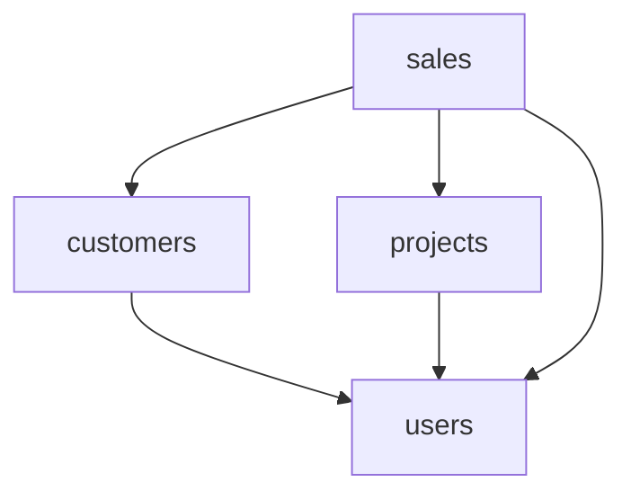

# Jmix Composite Project Sample

This project demonstrates an approach to work with add-ons and applications in a single IDE project, without the need to publish add-ons in a repository to test them in the application.

The sample is based on Jmix 2.x.

The composite project consists of the following subprojects:

- `users`, `customers`, `projects` - add-ons
- `sales` - target application
- `all` - aggregating composite project

The subprojects can be stored in separate Git repositories.

Dependencies between the subprojects:

## Usage

- Clone the repository.
- Open `./all` directory in IntelliJ IDEA with Jmix Studio plugin installed.
- Wait until Gradle import is finished.